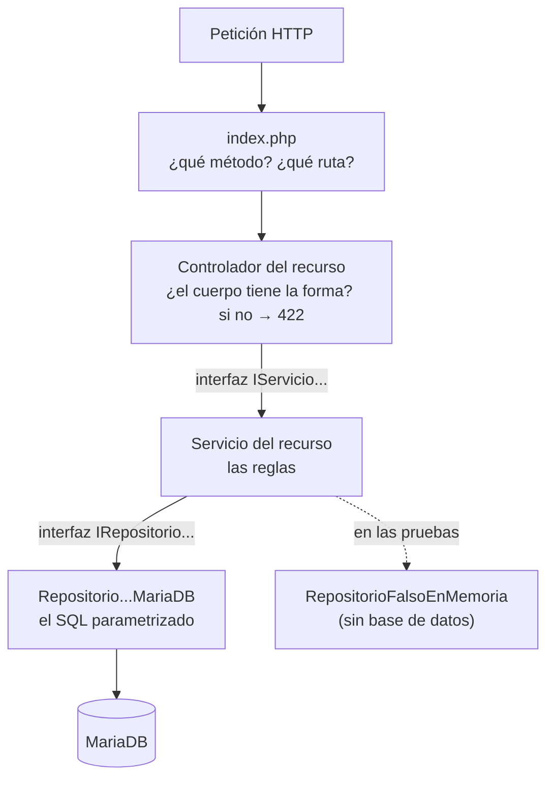

# Plan técnico — v1: Investigación (PHP + MariaDB)

## 1. El árbol, y qué hace cada carpeta

En el repositorio de la API:

```text
api_investigacion/
├── index.php
│                           ENRUTA: método + ruta → controlador del recurso.
│                           No contiene SQL ni reglas de negocio.
│
├── controladores/
│   ├── ControladorAreaConocimiento.php
│   ├── ControladorObjetivoDesarrolloSostenible.php
│   ├── ControladorAreaAplicacion.php
│   ├── ControladorTerminoClave.php
│   ├── ControladorUniversidad.php
│   └── ControladorLineaInvestigacion.php
│                           HTTP: validan la FORMA del cuerpo (422) y traducen
│                           excepciones a códigos. Sin SQL, sin reglas.
│
├── servicios/
│   ├── IServicioAreaConocimiento.php
│   ├── ServicioAreaConocimiento.php
│   ├── IServicioObjetivoDesarrolloSostenible.php
│   ├── ServicioObjetivoDesarrolloSostenible.php
│   ├── IServicioAreaAplicacion.php
│   ├── ServicioAreaAplicacion.php
│   ├── IServicioTerminoClave.php
│   ├── ServicioTerminoClave.php
│   ├── IServicioUniversidad.php
│   ├── ServicioUniversidad.php
│   ├── IServicioLineaInvestigacion.php
│   ├── ServicioLineaInvestigacion.php
│   └── ensamblador.php
│                           Las REGLAS. Lanzan excepciones de negocio; aquí no
│                           aparece HTTP ni SQL.
│                           ensamblador.php es el ÚNICO sitio que construye
│                           las clases concretas y lee la configuración.
│
├── repositorios/
│   ├── IRepositorioAreaConocimiento.php
│   ├── RepositorioAreaConocimientoMariaDB.php
│   ├── IRepositorioObjetivoDesarrolloSostenible.php
│   ├── RepositorioObjetivoDesarrolloSostenibleMariaDB.php
│   ├── IRepositorioAreaAplicacion.php
│   ├── RepositorioAreaAplicacionMariaDB.php
│   ├── IRepositorioTerminoClave.php
│   ├── RepositorioTerminoClaveMariaDB.php
│   ├── IRepositorioUniversidad.php
│   ├── RepositorioUniversidadMariaDB.php
│   ├── IRepositorioLineaInvestigacion.php
│   └── RepositorioLineaInvestigacionMariaDB.php
│                           El SQL, siempre con prepared statements.
│                           Es el único lugar que conoce PDO.
│
├── modelos/
│   ├── AreaConocimiento.php
│   ├── ObjetivoDesarrolloSostenible.php
│   ├── AreaAplicacion.php
│   ├── TerminoClave.php
│   ├── Universidad.php
│   └── LineaInvestigacion.php
│                           Cada ficha como objeto: propiedades privadas,
│                           getters y setters según corresponda.
│
├── excepciones/
│   ├── NoEncontradoExcepcion.php
│   └── ConflictoExcepcion.php
│                           Excepciones de negocio, sin códigos HTTP adentro.
│
└── pruebas/
    ├── prueba_capas.php
    │                       Prueba término clave, universidad y línea de investigación.
    ├── prueba_capas_restantes.php
    │                       Prueba los servicios de los otros tres recursos con
    │                       repositorios falsos, sin depender de MariaDB.
    └── prueba_controladores_restantes.php
                            Comprueba las respuestas de los otros tres
                            controladores con servicios simulados.

```


## 2. El recorrido de una petición


La flecha punteada es el punto: el servicio depende de la interfaz del
repositorio y no de la implementación concreta de MariaDB.
Por ejemplo, ServicioUniversidad depende de IRepositorioUniversidad.
Durante la ejecución normal se le conecta
RepositorioUniversidadMariaDB, mientras que en prueba_capas.php se le
puede conectar un repositorio falso que guarde los datos en un array.
Así, las reglas del servicio pueden probarse con MariaDB apagada.
El mismo recorrido se aplica a los seis recursos de la v1:
- area_conocimiento
- objetivo_desarrollo_sostenible
- area_aplicacion
- termino_clave
- universidad
- linea_investigacion
Lo que cambia entre ellos son sus campos, sus validaciones y su llave
primaria; la separación entre controlador, servicio y repositorio se mantiene.


## 3. Las decisiones de diseño


### 3.1 La validación se escribe, no se declara

Como el proyecto usa PHP puro y no utiliza un framework, la forma del cuerpo
se valida explícitamente en cada controlador.

Cada recurso tiene campos distintos, así que su controlador valida según la
ficha definida en `2_spec.md`.

Por ejemplo, en `universidad` el campo `nombre` es obligatorio, debe ser texto
y puede tener hasta 60 caracteres:

```php
if (array_key_exists('nombre', $datos)) {
    $valor = $datos['nombre'];

    if (!is_string($valor) || trim($valor) === '' || mb_strlen($valor) > 60) {
        $errores[] = 'El campo nombre debe ser un texto de 1 a 60 caracteres.';
    }
} elseif ($obligatorios) {
    $errores[] = 'El campo nombre es obligatorio.';
}
```

Si la forma del cuerpo no cumple las reglas, el controlador responde 422
antes de llamar al servicio.
La validación queda escrita de forma explícita: se puede ver qué campo se
revisa, qué condición debe cumplir y qué mensaje recibe quien consume la API.
Las reglas cambian según el recurso. Por ejemplo:
- area_conocimiento.id es texto alfanumérico;
- universidad.id es entero;
- termino_clave.termino es texto y además es la llave primaria;
- linea_investigacion.id no se exige en el POST porque lo genera MariaDB.


### 3.2 PUT y PATCH: la diferencia está en qué campos son obligatorios

PUT reemplaza una ficha completa, mientras que PATCH modifica solamente los
campos enviados.
Los controladores pueden utilizar el mismo método privado de validación y
cambiar únicamente si los campos son obligatorios:

```php
$this->validarCampos($cuerpo, true);     // PUT: todos los campos obligatorios
$this->validarCampos($cuerpo, false);    // PATCH: solo valida lo que llegue
```

Con PUT, si falta uno de los campos obligatorios del recurso, el controlador
responde 422.
Con PATCH, solamente se validan los campos presentes en el cuerpo. Los que no
llegan conservan su valor actual.
En PATCH se conservan los valores de los campos no enviados. La capa de
persistencia aplica únicamente los cambios solicitados cuando construye el
UPDATE parcial; no se exige al cliente enviar la ficha completa.
Por ejemplo:

```json
{
    "ciudad": "Medellín"
}
```

en un PATCH de universidad modifica únicamente ciudad. nombre y tipo
no se sobrescriben.
Un PATCH con cuerpo vacío:

```json
{}
```

tiene una forma válida, pero no tiene nada que modificar. Por eso es una regla
de la operación y responde 400, no 422.


### 3.3 Dos interfaces por recurso, y para qué sirven de verdad

Cada recurso de la v1 tiene dos interfaces: una para su servicio y otra para
su repositorio.

Por ejemplo:

```
IServicioUniversidad
IRepositorioUniversidad
```

y de la misma manera:

```
IServicioAreaConocimiento
IRepositorioAreaConocimiento

IServicioObjetivoDesarrolloSostenible
IRepositorioObjetivoDesarrolloSostenible

IServicioAreaAplicacion
IRepositorioAreaAplicacion

IServicioTerminoClave
IRepositorioTerminoClave

IServicioLineaInvestigacion
IRepositorioLineaInvestigacion
```

PHP podría ejecutar el proyecto sin estas interfaces. Su utilidad aquí es
hacer comprobable la separación entre las capas.
Por ejemplo, ServicioUniversidad recibe en su constructor un
IRepositorioUniversidad, no directamente un
RepositorioUniversidadMariaDB.
En la aplicación normal se conecta:

```
ServicioUniversidad
        ↓
RepositorioUniversidadMariaDB
```

pero durante las pruebas se puede conectar:

```
ServicioUniversidad
        ↓
RepositorioUniversidadFalsoEnMemoria
```

sin modificar el servicio.
Así, prueba_capas.php puede probar las reglas utilizando un repositorio que
guarda los registros en un array y funcionar con MariaDB apagada.
Las interfaces no se agregan solamente por estructura: permiten demostrar que
el servicio depende del contrato del repositorio y no de una implementación
concreta.


### 3.4 El servicio no sabe qué es un 404 ni un 409

El servicio no trabaja con códigos HTTP.

Si un registro no existe o ya fue retirado, lanza
`NoEncontradoExcepcion`.

El controlador la atrapa y responde **404 Not Found**.

Si al crear un registro MariaDB detecta que la llave primaria ya está
ocupada, el repositorio traduce ese conflicto de persistencia a
`ConflictoExcepcion`.

El servicio no convierte esa excepción en un código HTTP: la deja llegar al
controlador.

El controlador la atrapa y responde **409 Conflict**.

Por ejemplo:

```text
ServicioUniversidad
    ├── universidad inexistente → NoEncontradoExcepcion
    └── id duplicado            → ConflictoExcepcion
```

El servicio conoce situaciones de negocio, no códigos HTTP.
Si mañana la misma lógica se utilizara desde otro tipo de aplicación que no
trabaje con HTTP, el servicio podría seguir funcionando sin cambiar sus
reglas.


### 3.5 Una particularidad de MariaDB: UPDATE con los mismos datos

MariaDB puede hacer que rowCount() de un UPDATE cuente las filas
modificadas y no necesariamente las filas encontradas.
Eso genera un problema cuando se envía un PUT con exactamente los mismos
datos que ya tiene el registro:

```
La fila existe
        ↓
el UPDATE la encuentra
        ↓
ningún valor cambia
        ↓
rowCount() devuelve 0
        ↓
parecería que la fila no existe
```

Eso produciría un 404 falso.
Para evitarlo, la conexión PDO utilizará:

```
PDO::MYSQL_ATTR_FOUND_ROWS => true
```

Así rowCount() permite saber si la fila fue encontrada, aunque los valores
enviados sean iguales a los que ya estaban almacenados.
Esta configuración se aplica a los repositorios MariaDB de los seis recursos
de la v1.

### 3.6 El borrado lógico se escribe en CADA consulta

Las consultas normales de los seis repositorios deben trabajar solamente con
registros activos.
Por eso los SELECT incluyen explícitamente:

```sql
WHERE activo = TRUE
```

El retiro tampoco utiliza DELETE FROM.
En su lugar ejecuta un UPDATE, por ejemplo:

```sql
UPDATE universidad
SET activo = FALSE
WHERE id = :id
  AND activo = TRUE
```

El AND activo = TRUE tampoco sobra.
Sin esa condición, retirar dos veces el mismo registro podría producir:

```
primer DELETE  → 200
segundo DELETE → 200
```

cuando el segundo debe responder 404, porque desde el punto de vista de la
API ese recurso ya no está disponible.
Después del retiro, la fila sigue almacenada en MariaDB, pero:
- no aparece en los listados;
- no se obtiene mediante el GET individual;
- no puede volver a retirarse como si siguiera activa.
El campo activo es interno de la persistencia. No se recibe como un campo
normal en POST, PUT o PATCH.


## 4. El front

El frontend vive en un repositorio separado de la API y se comunica con ella
únicamente por HTTP.

```text
front_php/
├── index.php
│                       PUNTO DE ENTRADA: sirve los archivos estáticos,
│                       coordina las rutas y conserva las rutas específicas
│                       de término clave, universidad y línea de investigación.
├── cliente_api.php
│                       ÚNICO COMPONENTE que llama a la API mediante HTTP;
│                       transforma sus respuestas en arrays para las vistas.
├── rutas_restantes.php
│                       Rutas de áreas de conocimiento, ODS y áreas de aplicación:
│                       listar, abrir formulario, crear, PUT, PATCH y retirar.
├── vistas/
│   ├── plantilla.php       Estructura común y navegación de los seis recursos.
│   ├── inicio.php          Panel principal con las seis entidades.
│   ├── lista.php           Listados de término clave, universidad y línea.
│   ├── formulario.php      Formularios de esas tres entidades.
│   ├── crud_restantes.php  Listados y formularios de conocimiento, ODS y aplicación.
│   └── no_encontrada.php   Pantalla de ruta no encontrada.
└── publico/
    ├── bootstrap.min.css
    └── bootstrap.bundle.min.js
```

**Ajuste durante la integración.** El plan original agrupaba todas las rutas
del frontend en `index.php`. Al integrar los seis CRUD se separaron las rutas
de los tres recursos restantes en `rutas_restantes.php`, con sus pantallas en
`vistas/crud_restantes.php`. `index.php` continúa siendo el único punto de
entrada y delega a ese archivo solamente las rutas que le corresponden.

`crud_restantes.php` comparte elementos visuales y una configuración cerrada
para esos tres recursos de la v1. No recibe nombres arbitrarios de tablas ni
realiza operaciones SQL. Las otras tres entidades conservan sus vistas y rutas
específicas existentes. La razón y las alternativas de este ajuste se registran
en `4_research.md`, decisión **D-v1-11**.

Aunque API y frontend están escritos en PHP, no comparten modelos, servicios
ni repositorios.
El frontend no hace require de archivos de api_investigacion/, no utiliza
PDO y no recibe las credenciales de MariaDB.

```
Navegador
    ↓
Frontend PHP
    ↓ HTTP
API de Investigación
    ↓
MariaDB
```

y nunca:

```
Frontend PHP
    ↓
MariaDB
```

La separación se comprueba apagando la API mientras la base permanece
encendida: el frontend debe seguir respondiendo, mostrar un aviso de que el
servicio no está disponible y no mostrar datos provenientes de MariaDB.

### Una pantalla para cada recurso

La v1 permite trabajar desde el frontend con los seis recursos:
- Áreas de conocimiento
- Objetivos de Desarrollo Sostenible
- Áreas de aplicación
- Términos clave
- Universidades
- Líneas de investigación
Cada recurso tendrá acceso a las operaciones que corresponden a su CRUD:
listar, crear, editar y retirar.
Las pantallas pueden compartir la plantilla y elementos visuales comunes,
pero el frontend no utiliza el nombre de una tabla como parámetro para crear
un CRUD genérico.

### Una lista vacía no es un error

termino_clave y linea_investigacion pueden iniciar sin registros.
Cuando la API responda 204 porque no existen filas activas, la pantalla no
debe tratarlo como un fallo del sistema.
Debe mostrar un mensaje comprensible, por ejemplo:

```
Todavía no hay registros.
```

y permitir crear uno nuevo.
Esto es distinto de que la API no responda. En ese caso la pantalla informa
que el servicio no está disponible.

### La pantalla no habla en términos de la API

Los detalles técnicos pertenecen a la API, no a la interfaz que utiliza la
persona.
Por eso palabras como:

```
PUT
PATCH
409
422
/api/
MariaDB
```

no se muestran como instrucciones de uso.
La diferencia entre PUT y PATCH se presenta mediante acciones comprensibles
para el usuario: guardar una ficha completa o guardar solamente los cambios.
Del mismo modo, el borrado lógico se presenta como retirar un registro,
porque la fila no se elimina físicamente de la base de datos.

### Los archivos estáticos no pasan por las rutas de la aplicación

Bootstrap se almacena dentro de publico/, no se obtiene desde un CDN.
Si el frontend se ejecuta utilizando el servidor incorporado de PHP con
index.php como router, los archivos que existen físicamente deben dejarse
servir directamente.

```
if (PHP_SAPI === 'cli-server') {
    $archivo = __DIR__ . $ruta;

    if ($ruta !== '/' && is_file($archivo)) {
        return false;
    }
}
```

Sin esta comprobación, una petición a un archivo como una hoja de estilos
podría terminar en el 404 de la aplicación y el navegador recibiría HTML
donde esperaba CSS.
Por eso no basta con comprobar que un archivo estático responda 200: también
debe llegar con el tipo de contenido correspondiente.


## 5. Chequeo de constitución

Antes de comenzar la implementación se comprueba que este plan respeta las
reglas permanentes definidas en `1_constitution.md`.

| Regla | Comprobación |
|---|---|
| PHP puro | API y frontend se desarrollan sin framework ni Composer |
| Arquitectura por capas | controlador → servicio → repositorio |
| Interfaces | los servicios dependen de interfaces de repositorio |
| PDO y prepared statements | solamente los repositorios acceden a MariaDB |
| Endpoints específicos | cada uno de los seis recursos tiene sus propias rutas |
| API y frontend separados | viven en repositorios distintos y se comunican por HTTP |
| Frontend sin acceso a BD | no utiliza PDO ni credenciales de MariaDB |
| Borrado lógico | DELETE marca `activo = FALSE` y las consultas filtran inactivos |
| Secretos | las credenciales se obtienen desde variables de entorno |
| Una versión incluye su front | los seis CRUD se construyen en API y frontend |
| No anticipar versiones | no se implementan tablas con FK, JWT, roles, dashboard ni funcionalidades posteriores |
| Todo en español | clases, métodos, variables, comentarios y mensajes siguen las convenciones del proyecto |
| Tipos estrictos | cada archivo PHP comienza con `declare(strict_types=1);` |

Resultado: el plan respeta la constitución y no presenta conflictos que
impidan comenzar la implementación de la v1.